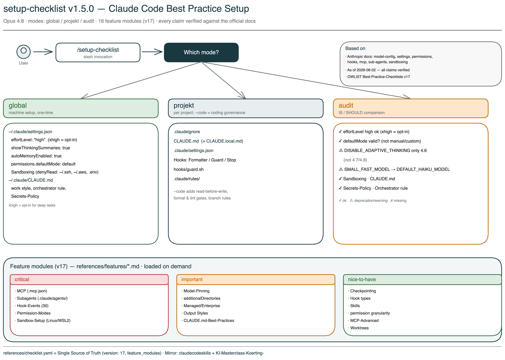

# Setup-Checklist Skill

Interactive setup assistant for Claude Code, tuned for Opus 4.8. The skill configures `settings.json`, `CLAUDE.md`, `.claudeignore`, hooks, and rules — globally or per project — and explains *why* each setting matters, rather than just copying config files.



> Working language of the skill is German. Triggers (`setup`, `einrichten`, `bootstrapping`, `audit`) and all interactive prompts remain German. This English README describes what the skill does and how to install it.

## What this skill handles for you

Claude Code has 50+ configurable settings, hooks, rules, and permission modes. Anthropic's official docs are comprehensive but spread out. This skill bundles the important best practices into a guided sequence:

- **Correct `settings.json`** — `effortLevel: "high"` (Opus-4.8 default, `xhigh` as opt-in), `showThinkingSummaries`, `autoMemoryEnabled`, sandboxing, permission mode
- **`CLAUDE.md` with clear working rules** — read-before-write, edit-over-write, secrets policy
- **Per-project hygiene** — `.claudeignore`, hooks (formatter / guard / stop reminder), modular rules
- **Audit** — IST/SOLL comparison with concrete correction offers, including warnings for deprecated env variables (`CLAUDE_CODE_DISABLE_ADAPTIVE_THINKING`, `ANTHROPIC_SMALL_FAST_MODEL`)

## Version

**v1.5.0** (June 2026, completeness pass) — tuned for Opus 4.8, based on checklist v17 (OWLIST GmbH).

What v1.5.0 brings:

- **Permission modes corrected** — the old values `manual/auto/custom` were wrong; the correct ones are `default/acceptEdits/plan/auto/dontAsk/bypassPermissions` (`permissions.defaultMode`).
- **16 in-depth feature modules** under `references/features/*.md`, each individually verified against the official docs (draft → adversarial verification). Covered, among others: MCP servers (`.mcp.json`), subagents (`.claude/agents/`), complete hook events (30), sandbox setup (Linux/WSL2), model pinning, additionalDirectories, managed/enterprise settings, output styles, CLAUDE.md best practices, checkpointing, skills, permission granularity, MCP advanced, worktrees. Index in `checklist.yaml` under `feature_modules`; the skill loads the matching module on demand. (Module bodies are currently in German.)

From v1.4.0 (Opus-4.8 update, still valid — all claims verified against the official docs on 2026-06-02):

- **Opus 4.8 as the default model.** The `effortLevel` default is now `high` (no longer `xhigh`); `xhigh` is a deliberate opt-in for deep engineering tasks. `max` is session-only.
- **Correction:** Agent Teams are **not** GA, but still experimental — `CLAUDE_CODE_EXPERIMENTAL_AGENT_TEAMS=1` turns them on and is **not** obsolete (v15 was wrong here).
- **Newly documented:** verified optional settings keys, new hook events, 1M-context syntax (`opus[1m]`), deprecation `ANTHROPIC_SMALL_FAST_MODEL` → `ANTHROPIC_DEFAULT_HAIKU_MODEL`.

Since v1.3.0 the skill also adds a mandatory section "Arbeitsweise: Agenten-Team" to the global `CLAUDE.md`:

- **Orchestrator mandate** — Claude is always lead, never solo. Substantive execution is delegated to sub-agents.
- **Three-tier execution mode** — `agentic` (lead + parallel sub-agents) / `sub-agents` (sequential) / `linear` (direct, small tasks).
- **Mandatory mini-briefing per sub-agent spawn** — role, context, concrete task, optional skill.

The audit mode also checks whether the orchestrator rule is anchored in the global CLAUDE.md.

## Installation

```bash
cp -r ~/Documents/GitHub/claudecodeskills/setup-checklist ~/.claude/skills/setup-checklist
```

Verify it works:

```
/setup-checklist
```

Without arguments the skill asks which mode you want.

## Four modes

### 1. `/setup-checklist global` — machine setup

One-time setup for all projects. The skill steps through each setting, explains the background, and asks yes/no:

| Setting | Recommendation | Why |
|---|---|---|
| `effortLevel` | `"high"` | Opus-4.8 default. Values: low, medium, high, xhigh. `xhigh` as an opt-in for deep engineering tasks; `max` is session-only (not in settings.json). |
| `showThinkingSummaries` | `true` | Diagnostic tool — shows whether Claude is thinking thoroughly or cutting corners |
| `autoMemoryEnabled` | `true` | Persistent learning between sessions |
| Sandboxing | enabled | Protects `~/.ssh/`, `~/.aws/`, `.env` from accidental access |
| Permission mode | `default` | `permissions.defaultMode` — values: default/acceptEdits/plan/auto/dontAsk/bypassPermissions (v17 correction; `manual/custom` do not exist) |

Plus: `~/.claude/CLAUDE.md` with working rules, secrets policy, and model hints for Opus 4.8 (1M context is automatic on Max/Team/Enterprise plans for Opus; enable manually via `opus[1m]` / `sonnet[1m]`, disable via `CLAUDE_CODE_DISABLE_1M_CONTEXT=1`).

The skill optionally offers further doc-verified keys (not mandatory), including `alwaysThinkingEnabled`, `defaultMode`, `outputStyle`, `skillOverrides`, `skillListingBudgetFraction`, `workflowKeywordTriggerEnabled`, `tui`, `viewMode`, `editorMode`, `modelOverrides`, `teammateMode`.

**Env variable notes (audit warns + offers a fix):**
- `CLAUDE_CODE_DISABLE_ADAPTIVE_THINKING` — only affects Opus 4.6/Sonnet 4.6, **no effect on 4.7/4.8**; do not set it for a 4.8 setup.
- `ANTHROPIC_SMALL_FAST_MODEL` — deprecated → `ANTHROPIC_DEFAULT_HAIKU_MODEL`.
- `CLAUDE_CODE_EXPERIMENTAL_AGENT_TEAMS` — **not** a deprecation case: deliberately turns on the still-experimental Agent Teams (optional).

### 2. `/setup-checklist projekt` — project setup

Setup for a single project (run in the project folder). Detects project type (Node.js / Python / Rust) and creates:

- `.claudeignore` — adapted to project type
- `CLAUDE.md` — project template with build commands and rules
- `CLAUDE.local.md` — personal overrides (+ `.gitignore` entry)
- `.claude/settings.json` — permissions + hooks (formatter, guard, stop reminder)
- `hooks/guard.sh` — protects sensitive files from Claude access
- `.claude/rules/` — modular rule files for lazy loading

Beyond the classic hook events, the docs now expose additional events the skill can reference: `TeammateIdle`, `TaskCreated`, `TaskCompleted`, `FileChanged`, `SubagentStart`/`SubagentStop`, `PreCompact`/`PostCompact`.

### 3. `/setup-checklist projekt --code` — with coding governance

Everything from project mode, plus strict rules:

- **Read-before-write** — read files fully before any change
- **Edit over write** — edit existing files, don't overwrite
- **Verification first** — tests before implementation
- **effortLevel: high** (or `xhigh` for deep tasks) anchored at project level

### 4. `/setup-checklist audit` — best-practice audit

Checks 19 criteria (10 global, 9 project) and shows a report:

```
GLOBAL (~/.claude/)
  ✓ settings.json present
  ✓ autoMemoryEnabled: true
  ✓ effortLevel: high (Opus-4.8 default; xhigh would be opt-in)
  ⚠ CLAUDE_CODE_DISABLE_ADAPTIVE_THINKING still set (no effect on 4.7/4.8)
  ⚠ ANTHROPIC_SMALL_FAST_MODEL still set (deprecated → ANTHROPIC_DEFAULT_HAIKU_MODEL)
  ✗ Thinking summaries not enabled
  ✗ Sandboxing not configured
  ✓ CLAUDE.md present (142 lines)
  ✓ Secrets policy present
  ✓ Orchestrator / agent-team rule present

RESULT: 6/19 checks passed, 2 deprecation warnings
```

For every ⚠ or ✗ the skill offers to correct it individually.

## Advanced feature modules (v17)

Beyond the core setup, v17 ships 16 in-depth modules under `references/features/`,
each with a guided explanation, a machine-readable reference block, and its own audit
criteria. The skill loads the matching module on demand (token-friendly) when you want
to set up a topic.

> The section framing here is English, but note: the module bodies themselves are
> currently in German. There are no separate English module files.

- **Critical:** MCP servers (`.mcp.json`) · subagents (`.claude/agents/`) · hook events (30, complete) · permission modes · sandbox setup (Linux/WSL2)
- **Important:** model pinning & provider overrides · additionalDirectories · managed/enterprise settings · output styles · CLAUDE.md best practices
- **Nice-to-have:** checkpointing & rewind · hook types · skills (`.claude/skills/`) · permission granularity · MCP advanced (OAuth) · worktrees/housekeeping/auth

Index: `references/checklist.yaml` → `feature_modules`. Each module was individually verified against the official docs (draft → adversarial cross-check).

## Guiding principles

- **NEVER overwrite existing files** without explicit confirmation
- **ALWAYS explain** what a setting does and why it is recommended
- **Idempotent** — can be run any number of times without harm
- **Merge rather than replace** — existing `settings.json` is merged, only missing keys added
- **Detect project type** and adapt templates accordingly
- **German** as working language for explanations and prompts

## History: Adaptive Thinking Regression (Opus 4.6, Summer 2025 — March 2026)

> Context for anyone familiar with the previous version. The problem is solved with Opus 4.7/4.8.

In summer 2025 Anthropic introduced **Adaptive Thinking** — Claude adjusts reasoning depth dynamically based on perceived task complexity. In March 2026 Stella Laurenzo (Director AI, AMD) published an analysis on GitHub (Issue #2654): 6,852 sessions, 234,760 tool calls. Measurable quality drop — reads before edits fell from 6.6 to 2.0, entire files were rewritten instead of edited precisely, "ownership dodging" rose from 0 to 10 per day.

Mitigation in v1.1.0 of this skill: `CLAUDE_CODE_DISABLE_ADAPTIVE_THINKING=1`.

**Redesigned with Opus 4.7/4.8:** Adaptive reasoning runs permanently and reliably, fixed thinking budgets no longer exist, and the flag has no effect on 4.7/4.8. The skill keeps the flag out of the template and warns in audit mode if it is still set.

## Sources

All claims verified against the official docs on 2026-06-02:

- [Claude Code Model Configuration](https://code.claude.com/docs/en/model-config) — effortLevel, adaptive reasoning, 1M context, model pinning
- [Settings Reference](https://code.claude.com/docs/en/settings) — settings.json keys, managed settings
- [Permissions](https://code.claude.com/docs/en/permissions) — permission modes, rule syntax, additionalDirectories
- [MCP](https://code.claude.com/docs/en/mcp) — .mcp.json, scopes, transports, OAuth
- [Subagents](https://code.claude.com/docs/en/sub-agents) — .claude/agents/, frontmatter
- [Sandboxing](https://code.claude.com/docs/en/sandboxing) — sandbox modes, Linux/WSL2
- [Output Styles](https://code.claude.com/docs/en/output-styles) · [Memory](https://code.claude.com/docs/en/memory) · [Checkpointing](https://code.claude.com/docs/en/checkpointing) · [Skills](https://code.claude.com/docs/en/skills)
- [Agent Teams](https://code.claude.com/docs/en/agent-teams) — status (experimental), flag, teammateMode
- [Hooks Reference](https://code.claude.com/docs/en/hooks) — hook events (30), hook types
- [Environment Variables](https://code.claude.com/docs/en/env-vars) — env var deprecations
- [GitHub Issue #2654](https://github.com/anthropics/claude-code/issues/2654) — Stella Laurenzo (AMD): thinking-depth analysis (historical reference, 4.6 era)
- Claude Code Best Practice Checklist v17 (OWLIST GmbH, June 2026, Opus-4.8 update)

## File structure

```
setup-checklist/
├── SKILL.md                          <- Skill logic (German)
├── SKILL.en.md                       <- English version
├── README.md                         <- German README
├── README.en.md                      <- This file
├── setup-checklist-overview.excalidraw <- Overview diagram (German labels)
├── setup-checklist-overview.png
├── setup-checklist-overview.en.excalidraw
├── setup-checklist-overview.en.png
└── references/
    ├── checklist.yaml                <- Machine-readable checklist (v17) + feature_modules index
    ├── features/                     <- 16 in-depth, individually verified setup modules (v17)
    └── templates/
        ├── settings-global.json
        ├── settings-projekt.json
        ├── claude-md-global.md
        ├── claude-md-projekt.md
        ├── claude-local-md.md
        ├── claudeignore
        ├── guard.sh
        ├── coding-style.md
        ├── api-security.md
        └── agent-patterns.md
```

## Version history

- **v1.5.0** (2026-06-02): Completeness pass (checklist v17). Permission modes corrected (manual/auto/custom → default/acceptEdits/plan/auto/dontAsk/bypassPermissions). 16 in-depth feature modules added under `references/features/*.md` (MCP, subagents, complete hook events, sandbox setup, model pinning, additionalDirectories, managed/enterprise, output styles, CLAUDE.md best practices, checkpointing, hook types, skills, permission granularity, MCP advanced, worktrees). Each module individually verified draft → adversarial against the docs. Index in `checklist.yaml` under `feature_modules`. (Module bodies are currently in German.)
- **v1.4.0** (2026-06-02): Opus-4.8 update (checklist v16). Default model Opus 4.8; `effortLevel` default back to `"high"`, `xhigh` as a documented opt-in, `max` clarified as session-only. **Correction:** Agent Teams are not GA, but still experimental — `CLAUDE_CODE_EXPERIMENTAL_AGENT_TEAMS` is no longer a deprecation case (the wrong v15 audit check was removed). New: verified optional settings keys, new hook events, 1M-context syntax, deprecation `ANTHROPIC_SMALL_FAST_MODEL` → `ANTHROPIC_DEFAULT_HAIKU_MODEL`. All claims verified against the official docs.
- **v1.3.0** (2026-04-23): Orchestrator mandate. New CLAUDE.md section "Arbeitsweise: Agenten-Team" (orchestrator rule, three-tier execution mode agentic/sub-agents/linear, mandatory mini-briefing). New audit check "Orchestrator-/Agenten-Team-Regel vorhanden".
- **v1.2.0** (2026-04-21): Opus-4.7 update. `effortLevel` default raised to `"xhigh"`. `CLAUDE_CODE_DISABLE_ADAPTIVE_THINKING` and `CLAUDE_CODE_EXPERIMENTAL_AGENT_TEAMS` removed from template (obsolete / GA). Audit warns about deprecated env variables and offers removal. CLAUDE.md template extended with Opus-4.7 and 1M context hints. English doc variant + new Excalidraw diagram. Checklist v15.
- **v1.1.0** (2026-04-14): Adaptive thinking regression + interactive setup flow. New settings: `CLAUDE_CODE_DISABLE_ADAPTIVE_THINKING`, `showThinkingSummaries`. Interactive GLOBAL mode. Audit extended to 18 checks. Based on checklist v14.
- **v1.0.1** (2026-04-13): $schema URL fix, consistency fix (v12, audit 6/16)
- **v1.0.0** (2026-04-12): First release
