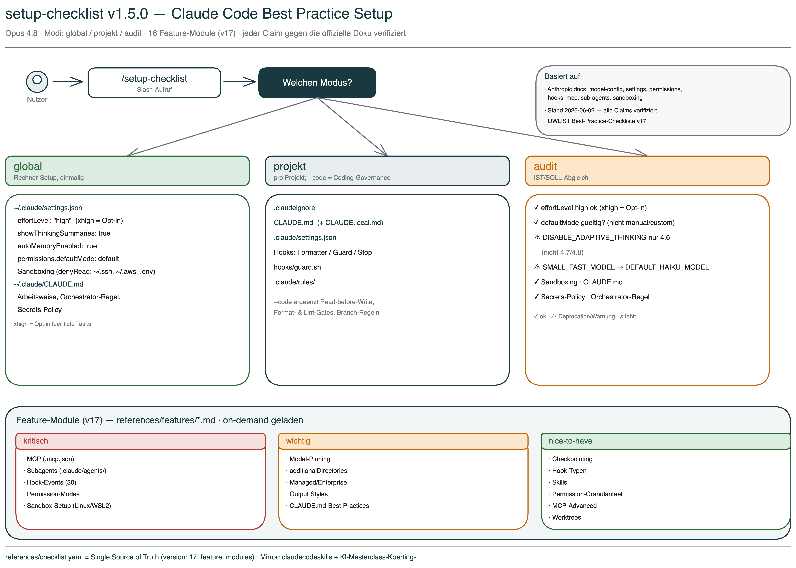

# Setup-Checklist Skill

Interaktiver Setup-Assistent fuer Claude Code, abgestimmt auf Opus 4.8. Der Skill konfiguriert `settings.json`, `CLAUDE.md`, `.claudeignore`, Hooks und Rules — pro Rechner oder pro Projekt — und erklaert bei jeder Einstellung *warum* sie sinnvoll ist, statt nur Config-Dateien zu kopieren.



## Was dieser Skill dir abnimmt

Claude Code hat ueber 50 konfigurierbare Einstellungen, Hooks, Rules und Permission-Modi. Die offizielle Anthropic-Doku ist umfangreich, aber verteilt. Dieser Skill buendelt die wichtigsten Best Practices in einer gefuehrten Sequenz:

- **`settings.json` richtig gesetzt** — `effortLevel: "high"` (Opus-4.8-Default, `xhigh` als Opt-in), `showThinkingSummaries`, `autoMemoryEnabled`, Sandboxing, Permission Mode
- **`CLAUDE.md` mit klaren Arbeits-Regeln** — Read-before-Write, Edit-vor-Write, Secrets-Policy
- **Pro-Projekt-Hygiene** — `.claudeignore`, Hooks (Formatter / Guard / Stop-Reminder), ausgelagerte Rules
- **Audit** — IST/SOLL-Abgleich mit konkreten Korrektur-Angeboten, inkl. Warnung bei veralteten Env-Variablen (`CLAUDE_CODE_DISABLE_ADAPTIVE_THINKING`, `ANTHROPIC_SMALL_FAST_MODEL`)

## Version

**v1.5.0** (Juni 2026, Vollstaendigkeits-Pass) — abgestimmt auf Opus 4.8, basiert auf Checkliste v17 (OWLIST GmbH).

Was v1.5.0 bringt:

- **Permission-Modes korrigiert** — die alten Werte `manual/auto/custom` waren falsch; korrekt sind `default/acceptEdits/plan/auto/dontAsk/bypassPermissions` (`permissions.defaultMode`).
- **16 vertiefende Feature-Module** unter `references/features/*.md`, jedes einzeln gegen die offizielle Doku verifiziert (Draft → adversariale Verifikation). Abgedeckt u.a.: MCP-Server (`.mcp.json`), Subagents (`.claude/agents/`), vollstaendige Hook-Events (30), Sandbox-Setup (Linux/WSL2), Model-Pinning, additionalDirectories, Managed/Enterprise-Settings, Output Styles, CLAUDE.md-Best-Practices, Checkpointing, Skills, Permission-Granularitaet, MCP-Advanced, Worktrees. Index in `checklist.yaml` unter `feature_modules`; der Skill laedt das passende Modul on-demand.

Aus v1.4.0 (Opus-4.8-Update, weiterhin gueltig — alle Claims am 2026-06-02 gegen die offizielle Doku verifiziert):

- **Opus 4.8 als Default-Modell.** `effortLevel`-Default ist jetzt `high` (nicht mehr `xhigh`); `xhigh` ist ein bewusstes Opt-in fuer tiefe Engineering-Tasks. `max` ist nur Session-only.
- **Korrektur:** Agent Teams sind **nicht** GA, sondern weiterhin experimentell — `CLAUDE_CODE_EXPERIMENTAL_AGENT_TEAMS=1` schaltet sie ein und ist **nicht** obsolet (v15 lag hier falsch).
- **Neu dokumentiert:** verifizierte optionale settings-Keys, neue Hook-Events, 1M-Context-Syntax (`opus[1m]`), Deprecation `ANTHROPIC_SMALL_FAST_MODEL` → `ANTHROPIC_DEFAULT_HAIKU_MODEL`.

Seit v1.3.0 ergaenzt der Skill ausserdem eine Pflicht-Sektion "Arbeitsweise: Agenten-Team" in der globalen `CLAUDE.md`:

- **Orchestrator-Pflicht** — Claude ist immer Lead, nie Solist. Substanzielle Ausfuehrung wird an Sub-Agents delegiert.
- **Dreistufiger Ausfuehrungsmodus** — `agentic` (Lead + parallele Sub-Agents) / `sub-agents` (sequentiell) / `linear` (direkt, kleine Aufgaben).
- **Mini-Briefing-Pflicht pro Sub-Agent-Spawn** — Rolle, Kontext, konkrete Aufgabe, optional Skill.

Zusaetzlich prueft der Audit-Modus, ob die Orchestrator-Regel in der globalen CLAUDE.md verankert ist.

## Installation

```bash
cp -r ~/Documents/GitHub/claudecodeskills/setup-checklist ~/.claude/skills/setup-checklist
```

Pruefen ob es funktioniert:

```
/setup-checklist
```

Ohne Argument fragt der Skill, welchen Modus du moechtest.

## Vier Modi

### 1. `/setup-checklist global` — Rechner-Setup

Einmaliges Setup fuer alle Projekte. Der Skill geht jedes Setting einzeln durch, erklaert den Hintergrund und fragt ja/nein:

| Setting | Empfehlung | Warum |
|---|---|---|
| `effortLevel` | `"high"` | Opus-4.8-Default. Werte: low, medium, high, xhigh. `xhigh` als Opt-in fuer tiefe Engineering-Tasks; `max` nur Session-only (nicht in settings.json). |
| `showThinkingSummaries` | `true` | Diagnose-Tool — zeigt ob Claude gruendlich denkt oder abkuerzt |
| `autoMemoryEnabled` | `true` | Persistentes Learning zwischen Sessions |
| Sandboxing | aktiv | Schuetzt `~/.ssh/`, `~/.aws/`, `.env` vor versehentlichem Zugriff |
| Permission Mode | `default` | `permissions.defaultMode` — Werte: default/acceptEdits/plan/auto/dontAsk/bypassPermissions (v17-Korrektur; `manual/custom` gibt es nicht) |

Plus: `~/.claude/CLAUDE.md` mit Arbeitsweise-Regeln, Secrets-Policy und Modell-Hinweisen zu Opus 4.8 (1M-Context bei Max/Team/Enterprise automatisch aktiv; manuell via `opus[1m]`).

Optional bietet der Skill weitere in der Doku verifizierte Keys an (kein Pflichtteil), u.a. `alwaysThinkingEnabled`, `defaultMode`, `outputStyle`, `skillOverrides`, `tui`, `viewMode`, `editorMode`.

**Env-Variablen-Hinweise (Audit warnt + bietet Korrektur):**
- `CLAUDE_CODE_DISABLE_ADAPTIVE_THINKING` — wirkt nur auf Opus 4.6/Sonnet 4.6, **wirkungslos auf 4.7/4.8**; bei 4.8-Setup nicht setzen.
- `ANTHROPIC_SMALL_FAST_MODEL` — deprecated → `ANTHROPIC_DEFAULT_HAIKU_MODEL`.
- `CLAUDE_CODE_EXPERIMENTAL_AGENT_TEAMS` — **kein** Deprecation-Fall: schaltet die weiterhin experimentellen Agent Teams bewusst ein (optional).

### 2. `/setup-checklist projekt` — Projekt-Setup

Setup fuer ein einzelnes Projekt (im Projektordner ausfuehren). Erkennt Projekttyp (Node.js / Python / Rust) und legt an:

- `.claudeignore` — angepasst an Projekttyp
- `CLAUDE.md` — Projekt-Template mit Build-Commands und Regeln
- `CLAUDE.local.md` — persoenliche Overrides (+ `.gitignore`-Eintrag)
- `.claude/settings.json` — Permissions + Hooks (Formatter, Guard, Stop-Reminder)
- `hooks/guard.sh` — schuetzt sensible Dateien vor Claude-Zugriff
- `.claude/rules/` — ausgelagerte Regelwerke fuer Lazy Loading

### 3. `/setup-checklist projekt --code` — mit Coding-Governance

Alles aus dem Projekt-Modus, plus strenge Regeln:

- **Read-before-Write** — Dateien vollstaendig lesen vor jeder Aenderung
- **Edit-vor-Write** — bestehende Dateien editieren, nicht ueberschreiben
- **Verification-first** — Tests vor Implementierung
- **effortLevel: high** (oder `xhigh` fuer tiefe Tasks) auch projekt-lokal verankert

### 4. `/setup-checklist audit` — Best-Practice-Audit

Prueft 19 Kriterien (10 global, 9 projekt) und zeigt einen Report:

```
GLOBAL (~/.claude/)
  ✓ settings.json vorhanden
  ✓ autoMemoryEnabled: true
  ✓ effortLevel: high (Opus-4.8-Default; xhigh waere Opt-in)
  ⚠ CLAUDE_CODE_DISABLE_ADAPTIVE_THINKING noch gesetzt (wirkungslos auf 4.7/4.8)
  ⚠ ANTHROPIC_SMALL_FAST_MODEL noch gesetzt (deprecated → ANTHROPIC_DEFAULT_HAIKU_MODEL)
  ✗ Thinking-Summaries nicht aktiviert
  ✗ Sandboxing nicht konfiguriert
  ✓ CLAUDE.md vorhanden (142 Zeilen)
  ✓ Secrets-Policy vorhanden
  ✓ Orchestrator-/Agenten-Team-Regel vorhanden

ERGEBNIS: 6/19 Checks bestanden, 2 Deprecation-Warnungen
```

Fuer jeden ⚠ oder ✗ bietet der Skill an, einzeln zu korrigieren.

## Erweiterte Feature-Module (v17)

Ueber das Kern-Setup hinaus liefert v17 16 vertiefende Module unter `references/features/`,
jeweils mit gefuehrter Erklaerung, maschinenlesbarem Referenzblock und eigenen Audit-Kriterien.
Der Skill laedt das passende Modul on-demand (Token-schonend), wenn du ein Thema einrichten willst.

- **Kritisch:** MCP-Server (`.mcp.json`) · Subagents (`.claude/agents/`) · Hook-Events (30, vollstaendig) · Permission-Modes · Sandbox-Setup (Linux/WSL2)
- **Wichtig:** Model-Pinning & Provider-Overrides · additionalDirectories · Managed/Enterprise-Settings · Output Styles · CLAUDE.md-Best-Practices
- **Nice-to-have:** Checkpointing & Rewind · Hook-Typen · Skills (`.claude/skills/`) · Permission-Granularitaet · MCP-Advanced (OAuth) · Worktrees/Housekeeping/Auth

Index: `references/checklist.yaml` → `feature_modules`. Jedes Modul wurde einzeln gegen die offizielle Doku verifiziert (Draft → adversariale Gegenpruefung).

## Leitprinzipien

- **NIEMALS bestehende Dateien ueberschreiben** ohne explizite Bestaetigung
- **IMMER erklaeren** was eine Einstellung tut und warum sie empfohlen wird
- **Idempotent** — beliebig oft ausfuehrbar ohne Schaden
- **Merge statt Replace** — bestehende `settings.json` wird gemerged, nur fehlende Keys ergaenzt
- **Projekttyp erkennen** und Templates entsprechend anpassen
- **Deutsch** als Arbeitssprache fuer Erklaerungen und Ausgaben

## Historie: Adaptive Thinking Regression (Opus 4.6, Sommer 2025 — Maerz 2026)

> Kontext-Info fuer alle, die die Vorgaenger-Version kennen. Mit Opus 4.7 ist das Problem geloest.

Im Sommer 2025 fuehrte Anthropic **Adaptive Thinking** ein — Claude passt die Reasoning-Tiefe dynamisch an die vermutete Komplexitaet an. Im Maerz 2026 veroeffentlichte Stella Laurenzo (Director AI, AMD) eine Analyse auf GitHub (Issue #2654): 6.852 Sessions, 234.760 Tool Calls. Messbarer Qualitaetsabfall — Reads vor Edits fielen von 6.6 auf 2.0, ganze Dateien wurden neu geschrieben statt gezielt editiert, "Ownership Dodging" stieg von 0 auf 10 pro Tag.

Gegenmassnahme in v1.1.0 dieses Skills: `CLAUDE_CODE_DISABLE_ADAPTIVE_THINKING=1`.

**Mit Opus 4.7/4.8 neu designt:** Adaptive Reasoning laeuft permanent und zuverlaessig, Fixed-Thinking-Budgets gibt es nicht mehr, das Flag greift auf 4.7/4.8 nicht. Der Skill haelt das Flag aus dem Template heraus und warnt im Audit, wenn es noch gesetzt ist.

## Quellen

Alle Aussagen am 2026-06-02 gegen die offizielle Doku verifiziert:

- [Claude Code Model Configuration](https://code.claude.com/docs/en/model-config) — effortLevel, Adaptive Reasoning, 1M-Context, Model-Pinning
- [Settings Reference](https://code.claude.com/docs/en/settings) — settings.json-Keys, Managed-Settings
- [Permissions](https://code.claude.com/docs/en/permissions) — Permission-Modes, Regel-Syntax, additionalDirectories
- [MCP](https://code.claude.com/docs/en/mcp) — .mcp.json, Scopes, Transporte, OAuth
- [Subagents](https://code.claude.com/docs/en/sub-agents) — .claude/agents/, Frontmatter
- [Sandboxing](https://code.claude.com/docs/en/sandboxing) — Sandbox-Modi, Linux/WSL2
- [Output Styles](https://code.claude.com/docs/en/output-styles) · [Memory](https://code.claude.com/docs/en/memory) · [Checkpointing](https://code.claude.com/docs/en/checkpointing) · [Skills](https://code.claude.com/docs/en/skills)
- [Agent Teams](https://code.claude.com/docs/en/agent-teams) — Status (experimentell), Flag, teammateMode
- [Hooks Reference](https://code.claude.com/docs/en/hooks) — Hook-Events (30), Hook-Typen
- [Environment Variables](https://code.claude.com/docs/en/env-vars) — Env-Var-Deprecations
- [GitHub Issue #2654](https://github.com/anthropics/claude-code/issues/2654) — Stella Laurenzo (AMD): Thinking-Depth-Analyse (historische Referenz, 4.6-Aera)
- Claude Code Best Practice Checkliste v17 (OWLIST GmbH, Juni 2026, Opus 4.8 + Vollstaendigkeits-Pass)

## Dateistruktur

```
setup-checklist/
├── SKILL.md                          <- Skill-Logik (Modus-Erkennung, Ablauf, Regeln)
├── SKILL.en.md                       <- Englische Version
├── README.md                         <- Diese Datei
├── README.en.md                      <- Englische Version
├── setup-checklist-overview.excalidraw <- Uebersichtsdiagramm (Excalidraw, DE)
├── setup-checklist-overview.png        <- Uebersichtsdiagramm (gerendert, DE)
├── setup-checklist-overview.en.excalidraw
├── setup-checklist-overview.en.png
└── references/
    ├── checklist.yaml                <- Maschinenlesbare Checkliste (v17) + feature_modules-Index
    ├── features/                     <- 16 vertiefende, einzeln verifizierte Setup-Module (v17)
    └── templates/
        ├── settings-global.json      <- ~/.claude/settings.json Vorlage
        ├── settings-projekt.json     <- .claude/settings.json mit Hooks
        ├── claude-md-global.md       <- ~/.claude/CLAUDE.md Vorlage
        ├── claude-md-projekt.md      <- Projekt-CLAUDE.md Vorlage
        ├── claude-local-md.md        <- CLAUDE.local.md Vorlage
        ├── claudeignore              <- .claudeignore Vorlage
        ├── guard.sh                  <- Guard-Script (PreToolUse-Hook)
        ├── coding-style.md           <- Coding-Style Rules
        ├── api-security.md           <- API Security Rules
        └── agent-patterns.md         <- Agent-Team-Patterns
```

## Versionshistorie

- **v1.5.0** (2026-06-02): Vollstaendigkeits-Pass (Checkliste v17). Permission-Modes korrigiert (manual/auto/custom → default/acceptEdits/plan/auto/dontAsk/bypassPermissions). 16 vertiefende Feature-Module unter `references/features/*.md` ergaenzt (MCP, Subagents, vollstaendige Hook-Events, Sandbox-Setup, Model-Pinning, additionalDirectories, Managed/Enterprise, Output Styles, CLAUDE.md-Best-Practices, Checkpointing, Hook-Typen, Skills, Permission-Granularitaet, MCP-Advanced, Worktrees). Jedes Modul einzeln Draft → adversarial gegen die Doku verifiziert. Index in `checklist.yaml` unter `feature_modules`.
- **v1.4.0** (2026-06-02): Opus-4.8-Update (Checkliste v16). Default-Modell Opus 4.8; `effortLevel`-Default auf `"high"` zurueck, `xhigh` als dokumentiertes Opt-in, `max` als Session-only klargestellt. **Korrektur:** Agent Teams sind nicht GA, sondern weiterhin experimentell — `CLAUDE_CODE_EXPERIMENTAL_AGENT_TEAMS` ist kein Deprecation-Fall mehr (falscher Audit-Check aus v15 entfernt). Neu: verifizierte optionale settings-Keys, neue Hook-Events, 1M-Context-Syntax, Deprecation `ANTHROPIC_SMALL_FAST_MODEL` → `ANTHROPIC_DEFAULT_HAIKU_MODEL`. Alle Claims gegen die offizielle Doku verifiziert.
- **v1.3.0** (2026-04-23): Orchestrator-Pflicht. Neue CLAUDE.md-Sektion "Arbeitsweise: Agenten-Team" (Orchestrator-Regel, dreistufiger Ausfuehrungsmodus agentic/sub-agents/linear, Mini-Briefing-Pflicht). Neuer Audit-Check "Orchestrator-/Agenten-Team-Regel vorhanden".
- **v1.2.0** (2026-04-21): Opus-4.7-Update. `effortLevel` Default auf `"xhigh"` gehoben. `CLAUDE_CODE_DISABLE_ADAPTIVE_THINKING` und `CLAUDE_CODE_EXPERIMENTAL_AGENT_TEAMS` entfernt. Audit warnt bei veralteten Env-Vars. CLAUDE.md-Template um Opus-4.7- und 1M-Context-Hinweise erweitert. Englische Doku-Variante + neues Excalidraw-Diagramm. Checkliste v15.
- **v1.1.0** (2026-04-14): Adaptive Thinking Regression + interaktiver Setup-Flow. Neue Settings: `CLAUDE_CODE_DISABLE_ADAPTIVE_THINKING`, `showThinkingSummaries`. Interaktiver GLOBAL-Modus. Audit auf 18 Checks. Basiert auf Checkliste v14.
- **v1.0.1** (2026-04-13): Fix $schema-URL, Konsistenz-Fix (v12, Audit 6/16)
- **v1.0.0** (2026-04-12): Erster Release
